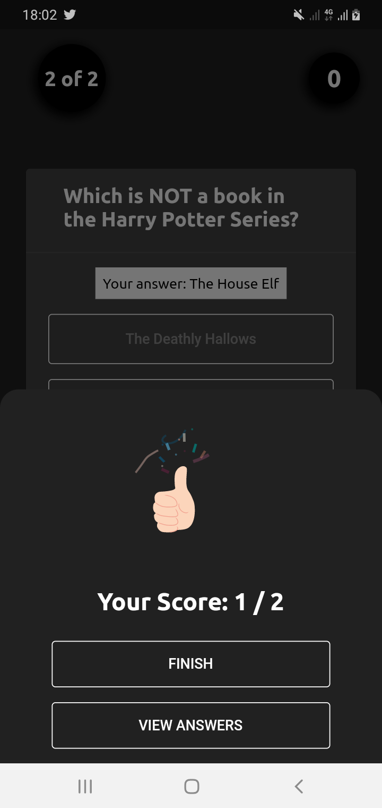
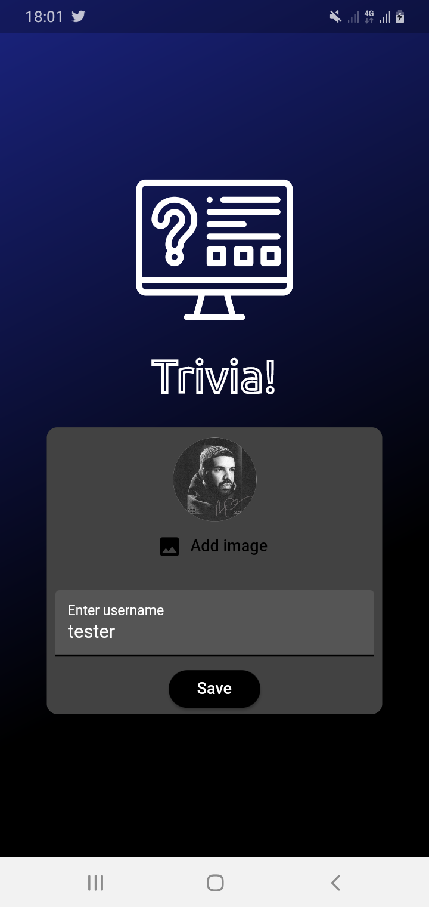
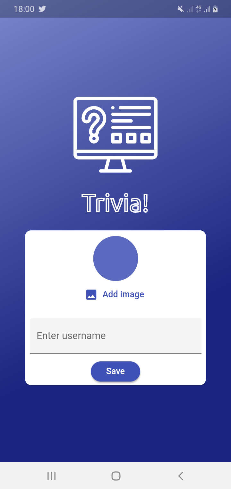
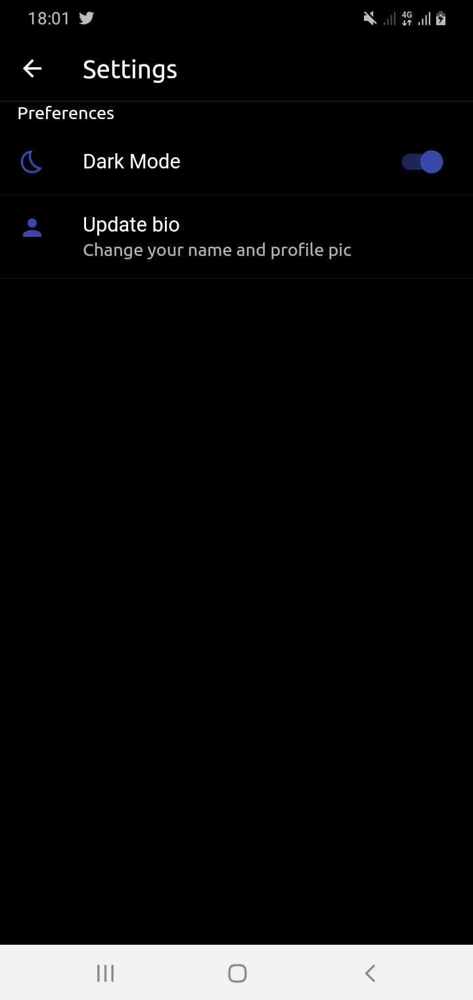
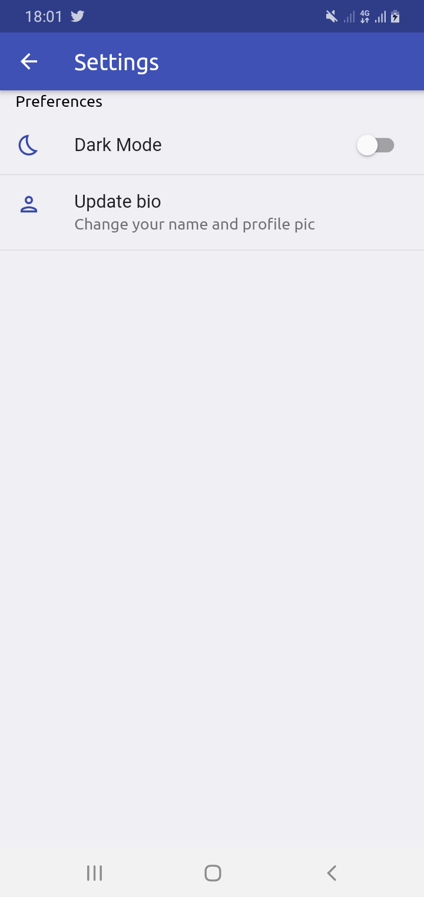

# Trivia

A quiz application to test your knoweldege.

## Getting Started

    - Run main.dart file
    - Sign up only once
    - Make sure you are connected to the internet
    - Select your favorite category to test your knowledge
    - Enjoy the quiz!

### Screenshots

| Dark Mode | Light Mode |
|-----------|-------------|
| |  |
| |  |
| |  |

### Nice Features

    - One time login
    - Offers the dark mode experience!
    - Save users 'taken quiz' using native device DBMS

### LICENSE

                    Apache License
                 Version 2.0, January 2004
                http://www.apache.org/licenses/

                Copyright 2020 Akindele Olawole

    Licensed under the Apache License, Version 2.0 (the "License");
    you may not use this file except in compliance with the License.
    You may obtain a copy of the License at

            http://www.apache.org/licenses/LICENSE-2.0

    Unless required by applicable law or agreed to in writing, software
    distributed under the License is distributed on an "AS IS" BASIS,
    WITHOUT WARRANTIES OR CONDITIONS OF ANY KIND, either express or implied.
    See the License for the specific language governing permissions and
    limitations under the License.

### Contact

Follow me on

- Twitter: [Delé](https://twitter.com/_Akindele_Mike)
- Github: [DeleMike](https://github.com/DeleMike)
