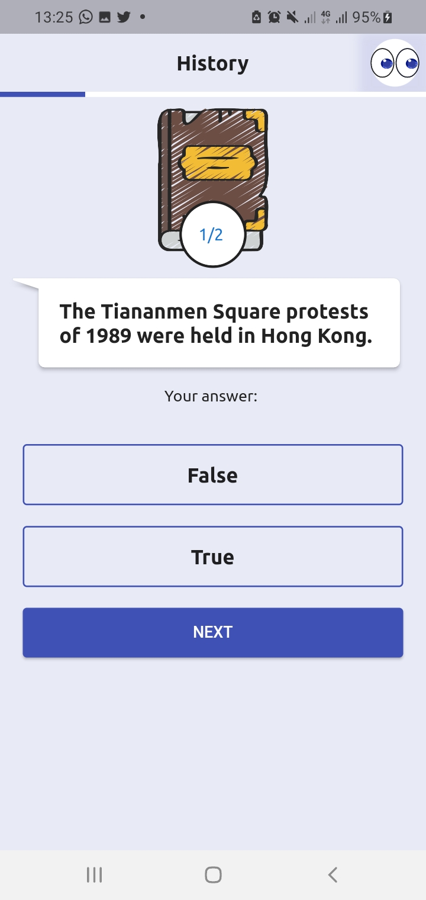

# Trivia

An app-type game application to test your vast knowledge.

 

## Key Notes

This app is primarily built to create a Trivia Game Application for users to enjoy & test their knowledge in a variety of topics.
The questions are heavily powered by **OpenTDB**(Open Trivia Database).

### Technical Notes

_For Developers:_ The app handles a lot of issues, like:

- State Management with Provider
- UI/UX management (Dark Theme Implemented)
- Internet connectivity(REST API Management) & internet watchers to ensure continued connectivity
- Statistiscal data management

**TODO:** More Unit Tests & Integration Testing!

## Screenshots

| Dark Mode | Light Mode |
|-----------|------------|
|  |  |
|  |  |
|  |  |
| |  |
| |  |

## Want to contribute to this project?

- Fork the project
- Get the url and clone into your computer
- Fix the bug or add a new feature!
- Test the app and submit a PR
- Enjoy!

### LICENSE

                    Apache License
                 Version 2.0, January 2004
                http://www.apache.org/licenses/

                Copyright 2020 Akindele Olawole

    Licensed under the Apache License, Version 2.0 (the "License");
    you may not use this file except in compliance with the License.
    You may obtain a copy of the License at

            http://www.apache.org/licenses/LICENSE-2.0

    Unless required by applicable law or agreed to in writing, software
    distributed under the License is distributed on an "AS IS" BASIS,
    WITHOUT WARRANTIES OR CONDITIONS OF ANY KIND, either express or implied.
    See the License for the specific language governing permissions and
    limitations under the License.

## Contact

- Email: [Akindele Michael](mailto:akindelemichael65@gmail.com?subject=Trivia%20App)
